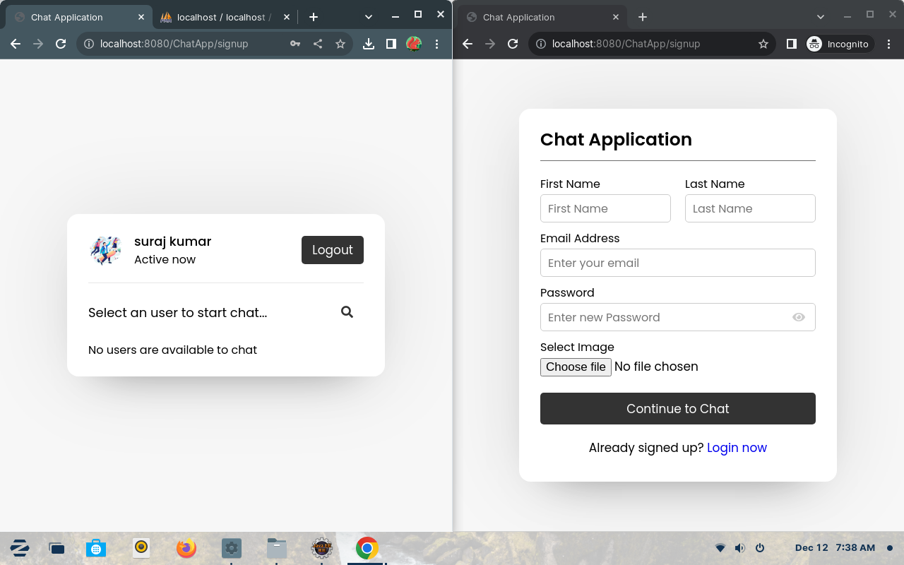
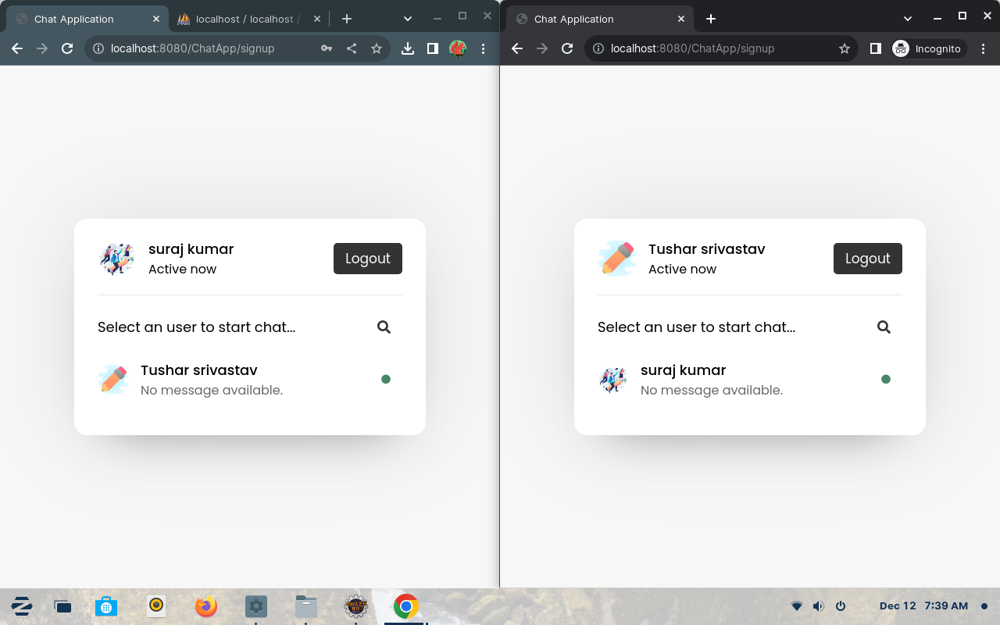
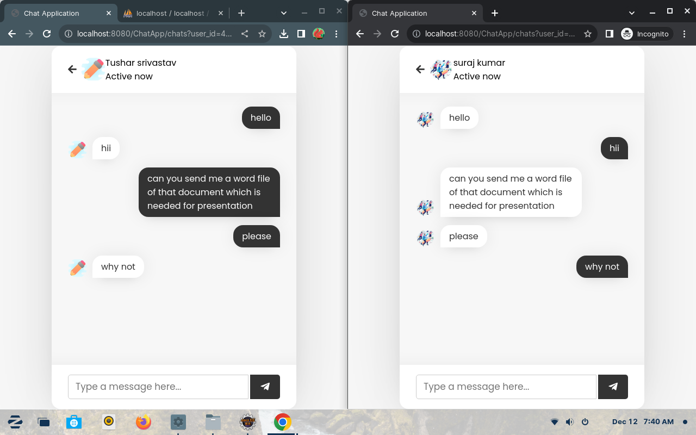
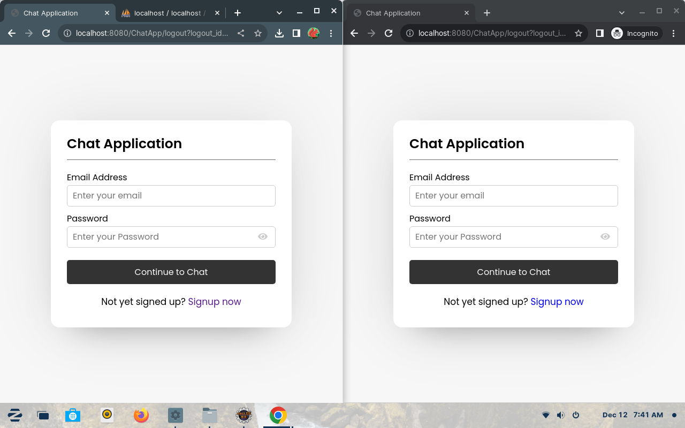

# WebChatApplication

A web based chat application created in java using Servlet, JSP, MySQL, CSS, JavaScript. It need atleast Apache Tomcat 10 web server to run.<br>
You can chat with your friends if you deploy this. Otherwise you can use a remote database, once you add tables on database you can simply distibute this application with your friends by using war files. 

## Technologies Used 
  1. Servlet 
  2. JSP
  3. HTML, CSS, JavaScript
  4. MySQL
  5. Apache Tomcat-10 web server
  6. Created in Eclipse Enterprise Edition IDE

## Screenshots

<div style="display: flex;flex-direction: column; grid-gap: 10px;">
    <div style="display: flex; grid-gap: 10px;">
        
        
    </div>
    <div style="display: flex; grid-gap: 10px;">
        
        
    </div>
</div>
<br>

## How to Use ?
  To run this application you need to set up this project on your <b>Eclipse EE IDE</b> here is how to do that : 

  <b>Step-1 :</b> After downloading, you have to keep this project on your workspace. Check your workspace from Eclipse also your can change your workspace by <br>
   <b>file->SwitchWorkspace->Other</b>
   and choose your workspace.

  <b>Stop-2 :</b> Download web development tools in your Eclipse IDE.<br>
   Go to  Help->Eclipse Marketplace->on search tab you can search for tools search 'web' on search area and download the tool <br>
          suggested one is :<i> Eclipse Enterprise Java and web developer tools 3.31</i><br>
          Or you can download anyone who supports servlet, jsp, and others mentioned above.

 <b>Step-3 :</b> Download Apache tomcat server make sure you use tomcat 10 and above. You can download this form official website [tomcat.apache.org](https://tomcat.apache.org/download-10.cgi), also Unzip it.

<b>Step-4 :</b> Setup Tocat with Eclipse : you can setup tomcat go to Windows->Show Views->Servers<br>
A new tab will open where console located, with the name of server click on the given link to add new server -> choose your company and version of server you intalled, in my case this is <b>Apache->Tomcat 10 ->click on next-> locate the Apache tomcat directory you downloaded in previous step.-> Hit on next if available otherwise click on finish.</b>

<b>Step-5 :</b> Open Your project in eclipse : 
     go to file->Open Project from file system-> locate your workspace and select the project(WebChatApp) folder -> click on open -> finish

<b>Step-6 :</b> Database Setup : to setup your database you can use the file database/chat.sql.
  using phpmyadmin = if you are using php myadmin then simpley create a new database with the name of 'chat' and then you can import file database/chat.sql from your import tab.
  
  using mysql command line client OR workbench - 
  you can simple run the given queries to create your database setup: 
    
  creating a database :
    
```sql
CREATE DATABASE chat;
```

  using the database :

```sql
USE chat;
```

  creating a table for messages :

```sql
CREATE TABLE `messages` (
  `msg_id` int(20) NOT NULL AUTO_INCREMENT,
  `incoming_msg_id` varchar(255) NOT NULL,
  `outgoing_msg_id` varchar(255) NOT NULL,
  `msg` varchar(1000) NOT NULL,
 PRIMARY KEY (`msg_id`)) AUTO_INCREMENT = 100;
``` 

  creating a table for users :

```sql
CREATE TABLE `users` (
  `user_id` int(11) NOT NULL AUTO_INCREMENT,
  `unique_id` varchar(200) NOT NULL,
  `fname` varchar(255) NOT NULL,
  `lname` varchar(255) NOT NULL,
  `email` varchar(255) NOT NULL,
  `password` varchar(255) NOT NULL,
  `img` varchar(400) NOT NULL,
  `status` varchar(255) NOT NULL,
 PRIMARY KEY (`msg_id`)) AUTO_INCREMENT = 100;
```
    
 <b>Step-7 :</b> Now you are ready to run the application: Right click on project(WebChatApp)->Run As->Run on Server->it may ask you what applications you want to run choose  WebChatApp and finish
 
<b>Step-8 :</b> After Starting the server you can access the application by your browser: open your browser and search for [http://localhost:8080/ChatApp/](/)

<b>Step-9 :</b> I hope this will helpful for you.


## Contributing

Pull requests are welcome. For major changes, please open an issue first
to discuss what you would like to change.

Please make sure to update tests as appropriate.

